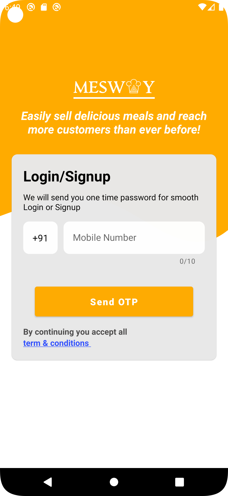
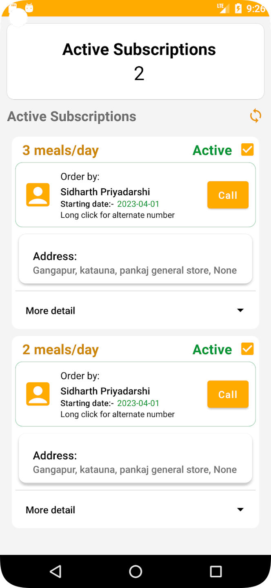
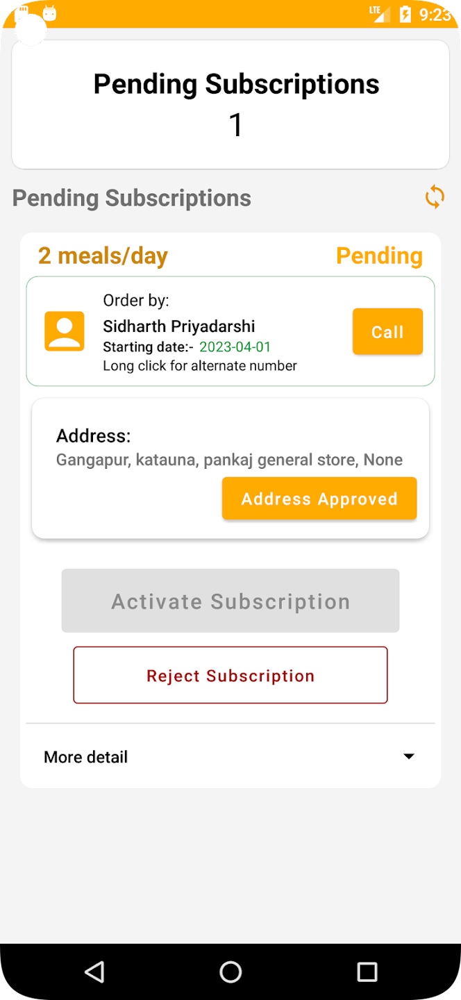
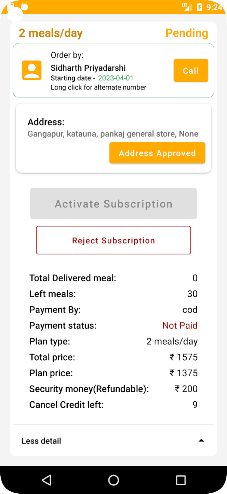
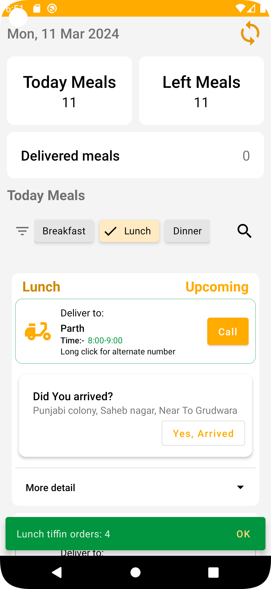

# Mesway Seller

Mesway Seller is an Android application designed to empower mess owners and meal providers to efficiently manage their offerings, orders, and interactions with customers. Mesway Seller streamlines order management, subscription management, and financial tracking, providing a comprehensive solution for running a successful food service business.

## Other related Projects

- **[Mesway](https://github.com/imsidharthpriyadarshi/Mesway-Find-Mess-Meal)**: This repository contains the codebase for the Mesway application, Mesway is designed to simplify the process of finding nearby mess services and managing meal subscriptions
- **[Mesway OTP](https://github.com/imsidharthpriyadarshi/Mesway-OTP)**: Mesway OTP is responsible for sending OTP for user sign in & sign up

## Screenshots

      

## Features
- **OAuth Authentication**: By implementing OAuth2 with JWT tokens, Mesway seller ensures a reliable and scalable authentication solution, safeguarding user accounts and enhancing the overall user experience.

- **Password-less Sign-in/Sign-up**: Authenticate users via OTP, eliminating the need for passwords and ensuring a secure login process.

- **Order Management**: Seamlessly manage incoming orders from customers. Receive real-time updates, track order status, and efficiently process orders for timely delivery.

- **Subscription Management**: Create and manage subscription plans to offer flexibility to customers. Define subscription durations (1-day, 7-days, 15-days, 30-days), customize meal options (breakfast, lunch, dinner), and set pricing tiers according to your subscription plan.

- **Subscription Rejection**: Ability to reject subscription requests with a valid reason, providing transparency to customers and maintaining service standards.

- **Earnings Tracking**: Keep track of total earnings and pending earnings, providing insights into your business performance and financial health.

- **Customizable Registration Process**: Implement a fully customizable 6-step registration process tailored to your business requirements.

- **Notifications**: Receive real-time updates through notification

## Technologies Used

- **Language**: Java
- **Authentication**: OAuth2 using JWT token
- **Backend Integration**: Utilizes FastAPI for backend services, PostgreSQL for the database, and AWS services (S3, Lambda, RDS) for deployment.
- **Login & Signup**: OTP based login & Signup
- **Architecture**: MVVM (Model-View-ViewModel)
- **Navigation**: Android Navigation Component
- **LiveData**: Android Architecture Components (LiveData)
- **Notifications**: Firebase Cloud Messaging (FCM)
- **Retrofit**: For network requests
- **Glide**: For image loading
- **Obfuscation & Shrinking**: I obfuscate and shrink the code using progaurd

## Installation

Mesway seller is available for download on the [Google Play Store](https://play.google.com/store/apps/details?id=seller.in.mesway). Simply visit the store page and install it on your Android device.

